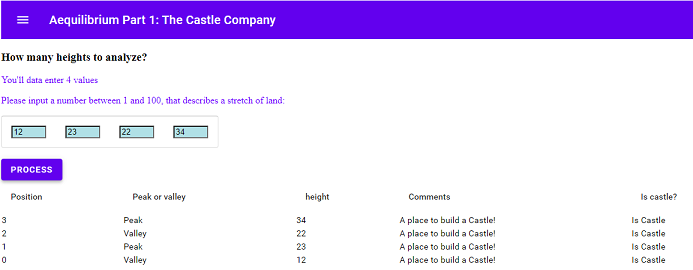

**Part 1: The Castle Company**

**Problem layout**

Aequilibrium is in the business of building castles (we really aren’t, but let’s pretend). Now, we also believe in quality aesthetics, so we only want to build castles in two types of places:

a. Peaks

b. Valleys

Let’s say you have an array of integers that describes a stretch of land, where each integer represents the current height of the land. Can you write a function that reads that array and returns the number of castles that Aequilibrium should build on that stretch of land? You can write this solution in whatever language you like and provide a way to test it.

You can make the following assumptions:

● You can always build a castle at the start of the array, provided it is non-empty

● You can always build a castle at the end of the array, provided it is non-empty

● We only want to build one castle per peak or valley.

● A peak is an integer or series of integers that is above the immediately preceding and following

ints. For example, in the sequence [2,6,6,6,3] the sequence of three 6s is a peak.

● A valley is an integer or series of integers that is below the immediately preceding and

following ints. For example, in the sequence [6,1,4] the "1" would be a valley.

**Project Structure**

Is a very simple application, javascript, vanilla kind, execution should be using ES6/ES2016 (because of the use of destructuring). Three files. Uses Material to embellish the app. More procedural than OO, because of the type of the project.

**Assumptions**

- The number of inputs of heights goes from 0 to 10(for easy operation).
- The heights can be from 0 to 100.

**Execution**

To run the sample, 

1. download the source code to a predetermined directory.
1. Copy the path of that directory.
1. ` `Paste in a navigator (Chrome, IE, Safari, etc.)
1. Refresh in the navigator.
1. Will show a screen like this: , you should enter in the field the number of data entries, that represent the heights.
1. Will appear a new dialogue like this: , fill each of the fields with the corresponding value; After finishing, press the button “PROCESS”.
1. Then will show you the result.

